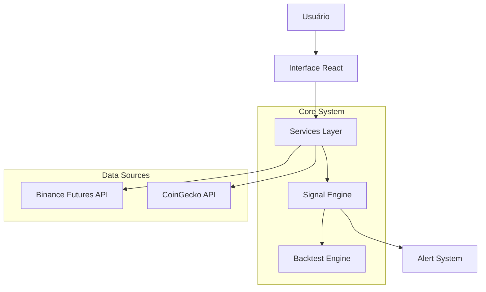

# Arquitetura do Sistema de Sinais

Este documento descreve a arquitetura do sistema de geração de sinais, backtesting e alertas.

## Visão Geral

O sistema é modular, dividido em camadas de serviço, utilitários de análise e interface de usuário.

## Componentes Principais

### 1. Camada de Dados (`src/services/`)
Responsável por buscar e normalizar dados de exchanges.
- **`binanceOHLC.ts`**: Busca velas (OHLCV) da Binance Futures.
- **`binanceFutures.ts`**: Busca dados de derivativos (Funding, Open Interest, Liquidações).
- **`coingeckoOHLC.ts`**: (Legado/Backup) Busca dados da CoinGecko.

### 2. Motor de Sinais (`src/services/advancedSignalGenerator.ts`)
O coração do sistema. Orquestra a análise de múltiplos módulos para gerar um sinal com `Quality Score`.

#### Módulos de Análise (`src/utils/`)
- **Tier 1 (Institucional)**:
    - `marketStructure.ts`: Detecta BOS, CHOCH, Pivôs e Tendência.
    - `smartMoney.ts`: Identifica Order Blocks, FVGs e Zonas de Liquidez.
    - `volumeProfile.ts` & `cvd.ts`: Analisa fluxo de volume e delta de agressão.
- **Tier 2 (Técnico)**:
    - `technicalIndicators.ts`: RSI, MACD, EMAs, Stochastic RSI.
    - `divergenceDetector.ts`: Encontra divergências Bullish/Bearish.
    - `bollingerAnalysis.ts`: Analisa volatilidade e Squeezes.

### 3. Backtesting (`src/utils/backtestEngine.ts`)
Simula a execução de estratégias em dados históricos.
- **Features**:
    - Simulação vela-a-vela (sem look-ahead).
    - Gestão de Risco (Stop Loss, Take Profit, Trailing Stop).
    - Cálculo de métricas (Sharpe, Drawdown, Win Rate).
    - Otimização de performance via pré-cálculo vetorial.

### 4. Sistema de Alertas (`src/services/alertSystem.ts`)
Monitora o mercado em background e dispara notificações.
- **Funcionalidades**:
    - Polling configurável (ex: 1min).
    - Debounce de alertas (evita spam).
    - Integração com Browser Notifications e Audio.

## Fluxo de Dados

1. **Ingestão**: `BacktestService` ou `AlertSystem` solicitam dados ao `BinanceOHLC`.
2. **Processamento**: Dados são passados para `AdvancedSignalGenerator`.
3. **Análise**:
    - `SmartMoney` varre estrutura institucional.
    - `Indicators` calculam momentum/tendência.
    - `QualityScore` pondera os fatores.
4. **Decisão**:
    - Se Score > Threshold (ex: 70), gera sinal de Entrada.
    - Define TP/SL baseado em estrutura (ex: FVG ou Swing Low).
5. **Execução/Alerta**:
    - **Backtest**: Simula ordem e acompanha PnL.
    - **Live**: Dispara alerta visual/sonoro.

## Tecnologias

- **Linguagem**: TypeScript
- **Runtime**: Node.js (Scripts) / Browser (React)
- **APIs**: REST (Binance FAPI)
- **Visualização**: Recharts (Equity Curve), Lightweight Charts (Candles - *Planejado*)
